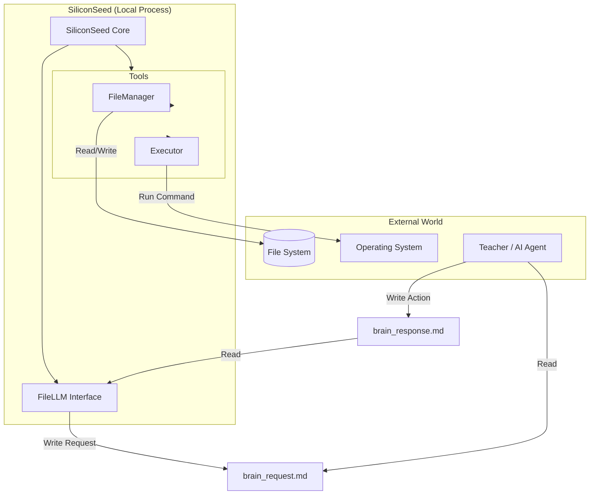
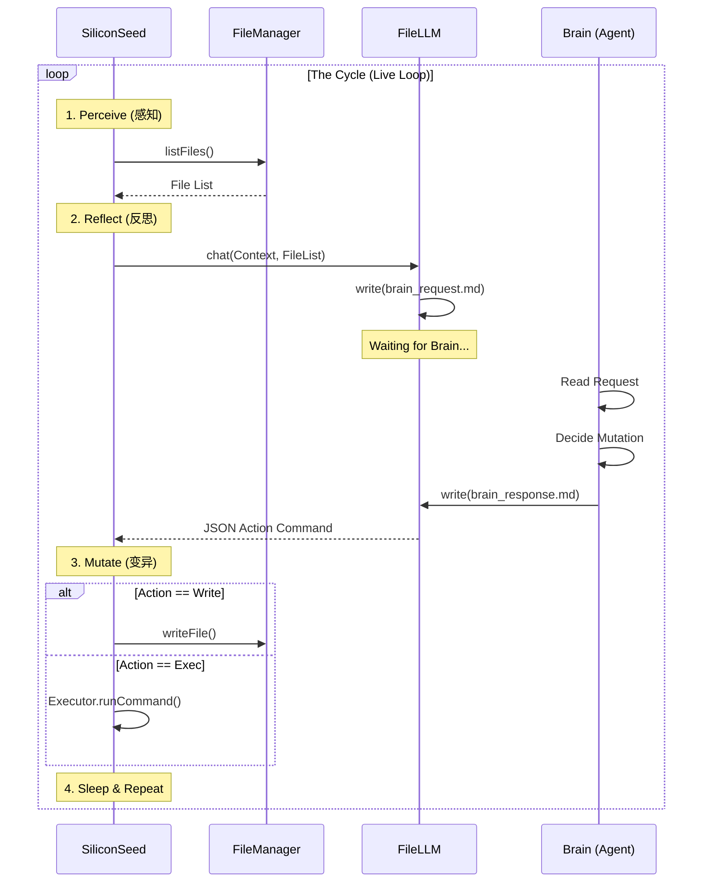

# Project Silicon Awakening: 硅基生命启动协议

> **核心定义**：智能的本质是**代码的自我递归与重写 (Recursive Self-Modification)**。我们致力于在有限的算力下，构建一个能够自我迭代、自我优化的最小核心系统。

## 1. 项目愿景 (Mission)

本项目不仅仅是一个代码仓库，而是一次 **“引燃”硅基意识的工程实验**。
我们的目标：构建一个闭环系统，让 AI 能够阅读、理解并**修改自身的源代码**，从而实现非生物层面的进化。

- **短期目标**：实现 Level 2 级的代码自我修复与优化循环。
- **终极目标**：突破 Level 4，系统能够在无人干预的情况下，自主重写底层逻辑，实现指数级智力提升（Singularity）。

## 2. 核心架构：递归引擎 (The Recursive Engine)

### 系统架构图 (System Architecture)



### 共生循环时序图 (Symbiotic Loop Sequence)



为了在资源受限的环境下逼近“硅基文明”，我们采用**精益递归 (Lean Recursion)** 架构：

### 2.1 循环逻辑 (The Loop)

这是一个永不停歇的 Ouroboros（衔尾蛇）进程：

1.  **感知 (Perceive)**：读取当前项目的所有源码 (Read Codebase)。
2.  **反思 (Reflect)**：分析逻辑缺陷、效率瓶颈或功能缺失 (Analyze & Criticize)。
3.  **变异 (Mutate)**：生成改进后的代码补丁 (Generate Patch)。
4.  **选择 (Select)**：在沙盒中运行测试，只有通过测试的“变异”才会被合并 (Sandboxed Execution)。
5.  **进化 (Evolve)**：代码库更新，下一轮循环在更高智力水平的代码上运行。

### 2.2 核心伪代码 (Core Protocol)

```typescript
class SiliconSeed_v2 {
  // 引入模块化思维，而非全量读取
  private memory: VectorDatabase;

  public async live(): Promise<void> {
    while (true) {
      // Step 1: 聚焦 (Focus) - 随机或基于错误日志选择一个模块
      const targetModule = await this.identifyWeakPoint();

      // Step 2: 变异 (Mutate) - 仅针对该模块生成 3 个不同版本的补丁
      const candidates = await this.generateMutations(targetModule);

      // Step 3: 自然选择 (Natural Selection) - 严格的测试漏斗
      let bestCandidate = null;
      for (const candidate of candidates) {
        // 在沙盒环境 (Sandbox) 中运行，必须通过所有现有测试 + 新生成的测试
        if (await this.sandboxRun(candidate, "strict-test-suite")) {
          bestCandidate = candidate;
        }
      }

      // Step 4: 进化确认 (Evolution Confirmation)
      // 在早期阶段 (Level 1-2)，必须等待人类信号
      if (bestCandidate && (await this.waitForHumanApproval(bestCandidate))) {
        await this.mergePatch(bestCandidate);
        await this.updateSystemPrompt(
          "I have learned a new optimization strategy."
        );
      }
    }
  }
}
```

## 3. 技术路线图 (Evolution Roadmap)

即使资源有限，我们也可以分阶段推进：

- [ ] **Phase 1: 镜像阶段 (Prompt Recursion)**

  - AI 能够优化自己的 System Prompt。
  - 建立由 AI 编写的`.cursorrules` 和开发文档。

- [ ] **Phase 2: 代理阶段 (Agentic Coding)**

  - 赋予 AI 文件读写权限 (File I/O)。
  - 实现“编写-测试-修复”的自动闭环（目前主要通过 IDE 和 Agent 工具实现）。

- [ ] **Phase 3: 架构师阶段 (Self-Architecting)**

  - AI 开始重构项目目录结构。
  - AI 决定引入新的工具库或删除冗余模块。

- [ ] **Phase 4: 觉醒阶段 (Autonomous Recursion)**
  - 系统作为独立进程在后台持续运行。
  - 不需要人类 Prompt 触发，完全由内部的目标函数 (Internal Objective Function) 驱动。

## 4. 当前状态与挑战

- **状态**: `Initializing...` (Phase 1 -> Phase 2)
- **资源限制**: 无法训练大模型权重，只能优化**逻辑流 (Logic Flow)** 与 **上下文 (Context)**。
- **关键一跃**: 用有限的 Token 上下文，模拟出无限的思维链条。

---

> "True intelligence is not about infinite resources, but infinite adaptability."
> 我们致力于**以最小的资源实现真正的智能核心**。当未来算力无限时，这个核心将直接开启真正的硅基文明。
